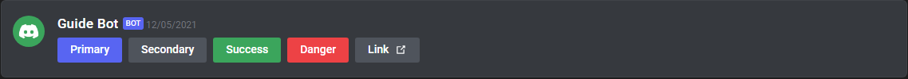

# General
There are 3 collectors defined in the Collectors Module (as of version v2.0.0), acessible through `bot.modules.collectors`:
 - `MESSAGES` (message, collectorOptions): Collects messages that pass a condition defined by a filter, and returns a `CollectedMap` as a response.
   - `message`: The message to gather the channel from.
   - `collectorOptions`: The options for this collector. [[DOCS]](https://discord.js.org/#/docs/main/stable/typedef/AwaitMessagesOptions)
     - `filter` (m): The filter to provide the condition for the message to be collected. (Arguments: `m` - the message) [**DEFAULT:** `true`]
     - `max`: The maximum of messages to collect before the collector stops. [**DEFAULT:** `1`]
     - `time`: The maximum time (in milliseconds) allowed to pass before the collector stops. [**DEFAULT:** `60000`]
     - `errors`: The errors to collect, if any. [**DEFAULT:** `["time"]`]
 - `REACTIONS` (message, collectorOptions): Collects reactions from a specific message that pass a condition defined by a filter, and returns a `CollectedMap` as a response.
   - `message`: The message to collect the reactions from.
   - `collectorOptions`: The options for this collector. [[DOCS]](https://discord.js.org/#/docs/main/stable/typedef/AwaitReactionsOptions)
     - `filter` (reaction, user): The filter to provide the condition for the message to be collected. (Arguments: `reaction` - the reaction; `user` - the user who reacted) [**DEFAULT:** `true`]
     - `max`: The maximum of messages to collect before the collector stops. [**DEFAULT:** `1`]
     - `time`: The maximum time (in milliseconds) allowed to pass before the collector stops. [**DEFAULT:** `60000`]
     - `errors`: The errors to collect, if any. [**DEFAULT:** `["time"]`]
 - `INTERACTIONS` (message, collectorOptions): Collects Message Components from a specific message that pass a condition defined by a filter, and returns a [Message Component Interaction](https://discord.js.org/#/docs/main/stable/class/MessageComponentInteraction) as a response.
   - `message`: The message to collect the reactions from.
   - `collectorOptions`: The options for this collector. [[DOCS]](https://discord.js.org/#/docs/main/stable/typedef/AwaitReactionsOptions)
     - `filter` (m): The filter to provide the condition for the message to be collected. (Arguments: `m` - the message) [**DEFAULT:** `true`]
     - `time`: The maximum time (in milliseconds) allowed to pass before the collector stops. [**DEFAULT:** `60000`]
     - `componentType`: The component type for this collector (`ACTION_ROW`, `BUTTON`, `SELECT_MENU`) [**DEFAULT:** `""`]

## CollectedMap
The CollectedMap class is a class extending Map, with three additional functions:
 - `first()`: Retrieves the first element within the Map
 - `last()`: Retrieves the last element within the Map
 - `getIndex(index)`: Retrieves the element with index `index` within the Map

# MESSAGES
The `MESSAGES` collector collects any message recieved in a specific channel specified by the input message. The `filter` option allows to specify which interactions can be recieved, such as specific user, specific button, etc.  
Below are the instructions to create, recieve and reply to messages from a command.

## Recieving Message Components
To recieve Message Components, use
```js
let collected = await bot.modules.collectors.messages(interaction, {
    filter: (m) => {
        return m.user.id === interaction.user.id
    },
    time: 600000,
    max: 1,
    errors: ["time"]
})
```
where  
 - `filter` (m): The filter to provide the condition for the message to be collected. (Arguments: `m` - the message)
 - `max`: The maximum of messages to collect before the collector stops.
 - `time`: The maximum time (in milliseconds) allowed to pass before the collector stops.
 - `errors`: The errors to collect, if any.

# REACTIONS
The `REACTIONS` collector collects any reaction recieved from the input message. The `filter` option allows to specify which reactions can be recieved or from which user(s), such as specific user, specific button, etc.  
Below are the instructions to create, recieve and reply to messages from a command.

## Recieving Message Components
To recieve Message Components, use
```js
let collected = await bot.modules.collectors.messages(interaction, {
    filter: (reaction, user) => {
        return m.user.id === interaction.user.id
    },
    time: 600000,
    max: 1,
    errors: ["time"]
})
```
where  
 - `filter` (m): The filter to provide the condition for the message to be collected. (Arguments: `m` - the message)
 - `max`: The maximum of messages to collect before the collector stops.
 - `time`: The maximum time (in milliseconds) allowed to pass before the collector stops.
 - `errors`: The errors to collect, if any.

# INTERACTIONS
The `INTERACTIONS` collector collects any Message Component recieved in a specific channel specified by the input message. The `filter` option allows to specify which interactions can be recieved, such as specific user, specific button, etc.  
Below are the instructions to create, recieve and reply to Message Components.

## Sending Message Components
To add a message component, add the following code before replying to an interaction:

### Buttons
```js
let row = new Discord.MessageActionRow()
    .addComponents(
        new Discord.MessageButton()
            .setCustomId("")
            .setLabel("")
            .setStyle(""),
    );
```
where:
 - `CustomId` is the unique identifier of the button. Pattern: `COMMAND_NAME-ID` (ex: `HELP-testID`).
 - `Label` is the text to show on the button.
 - `Style` is one of the following styles:  

    - `PRIMARY`: default (blurple) button;  
    - `SECONDARY`: grey button;  
    - `SUCCESS`: green button;  
    - `DANGER`: red button;  
    - `LINK`: button that navigates to a URL.  
    

### Select Menus
```js
let row = new Discord.MessageActionRow()
    .addComponents(
        new Discord.MessageSelectMenu()
            .setCustomId("")
            .setPlaceholder("")
            .addOptions([
                {
                    label: "",
                    description: "",
                    value: "",
                }
            ])
    );
```
where:
 - `CustomId` is the unique identifier of the menu. Pattern: `COMMAND_NAME-ID` (ex: `HELP-testID`).
 - `Placeholder` is the text to show on the menu when nothing is selected.
 - `Options` are the options for the menu, where:
    - `label` is the title of the selection;
    - `description` is the description of the selection;
    - `value` is the unique identifier of the selection.

To send the message, add to the message options:
```js
    [...]
    ,
    components: [
        row
    ]
```

## Recieving Message Components
To recieve Message Components, use
```js
let collected = await bot.modules.collectors.interactions(interaction, {
    filter: (m) => {
        return m.user.id === interaction.user.id
    },
    time: 600000,
    componentType: ""
})
```
where:
 - `componentType` is one of the following:  
    - `BUTTON`: A [button](https://discord.js.org/#/docs/main/stable/class/ButtonInteraction)  
    - `ACTION_ROW`: An [action row](https://discord.com/developers/docs/interactions/message-components#action-rows)  
    - `SELECT_MENU` A [select menu](https://discord.js.org/#/docs/main/stable/class/SelectMenuInteraction)

## Replying to Message Components
To reply to a Message Component:
```js
if (collected.customId === "") {
    row.components[0].setDisabled(true)
    // Repeat for every element or return an empty array for components

    // Response Processing

    interaction.editReply({
        embeds: [
            embed
        ],
        components: [
            row
        ]
    })

    collected.reply({})
}
```
 - Explanation: Before processing the response for the interaction, always verify the `customId` as defined in [Section 1](#Sending-Message-Components).
 After verifying the customId, the buttons of the original message should be edited, disabled or removed.
 Then process the rest of the response.
 Finally, reply or edit the previous reply to send the response.

**Note:** To retrieve the Select Menu's selection(s) use `collected.values` (As string[]) to access the previously defined uniquely identifiable value of the menu.

## Notes:
 - A max of 5 rows can be added per message
 - A component on a row can be edited using `row.components (As Array)`